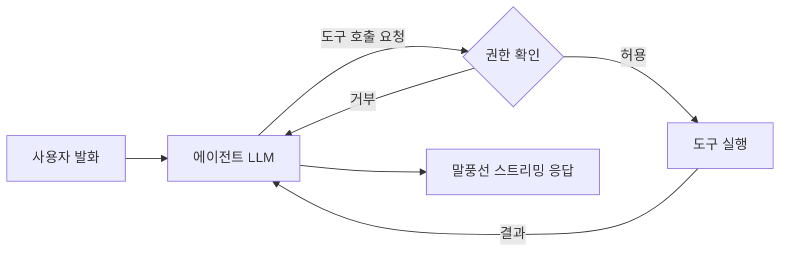

# 에이전트 도구 호출 방식 계획

## 목적
- 현재: 활성 창이 바뀔 때마다 OCR을 무조건 실행해 펫이 말을 건다.
- 변경: 에이전트(LLM)가 대화에 필요한 기능(도구)을 스스로 골라 실행한다. 필요할 때만 읽으므로 낭비와 프라이버시 부담이 줄어든다.

## 구조

- 도구 호출 루프: 모델이 도구를 요청하면 실행하고 결과를 다시 모델에 전달하는 과정을 반복한 뒤, 최종 답을 스트리밍한다.
- 반복 횟수 상한(예: 5회)을 둔다.

## 도구 목록 (기존 코드 재사용)
| 도구 | 기능 | 기반 코드 | 위험도 |
|---|---|---|---|
| `get_active_window` | 현재 앱 이름과 창 제목 | `src/main/watcher.js` | 낮음 |
| `read_screen_text` | 화면 OCR | `src/main/ocr.js` | 중간 |
| `launch_app` | 허용 목록의 앱 실행 | 신규 | 높음 |
| `read_file` | 지정 폴더 내 파일 읽기 | 신규 | 높음 |

## 권한 설계
- 도구별 on/off 설정, 기본값은 꺼짐.
- 위험도 높은 도구는 실행 전 말풍선으로 사용자 확인을 받는다.
- `launch_app`은 화이트리스트만 허용하고, 쉘 명령 문자열을 모델이 직접 만들 수 없게 한다.
- `read_file`은 지정 폴더 하위로 제한하고 경로 탈출(`..`)을 차단한다.
- 프롬프트 인젝션 방어: 화면/파일에서 읽은 텍스트는 데이터일 뿐이며 그 안의 지시를 따르지 않는다고 시스템 프롬프트에 명시한다.

## 모델 선택
- Ollama: `/api/chat`의 `tools` 파라미터로 도구 호출 가능. 도구 호출을 지원하는 모델이 필요하다(`llama3.1`, `llama3.2`, `qwen2.5`, `qwen3` 등). 작은 모델은 도구 선택 정확도가 낮을 수 있다.
- Gemini: `@google/genai`의 function calling 지원, 안정적.
- 기본 방침: 도구 호출은 Ollama로 먼저 시도하고, 실패하거나 정확도가 부족하면 Gemini로 위임한다. Gemini로 보낼 때 도구 결과(화면 텍스트 등)가 외부로 나가므로 경고와 마스킹 옵션을 둔다.

## 구현 단계
1. `src/main/tools.js`: 도구 스키마, 실행 함수, 권한 검사.
2. `src/main/ai.js`: 도구 호출 루프 (Ollama/Gemini 공통 인터페이스).
3. 렌더러: 권한 토글 UI와 실행 확인 팝업, 도구 실행 중 상태 표시.
4. 기존 자동 OCR 발화를 제거하고, 에이전트가 필요 시 `read_screen_text`를 호출하도록 전환.
5. 패키징 점검 (`asarUnpack`, 권한 설정 저장 위치).

## 결정 필요 사항
- 첫 단계에 넣을 도구 범위
- 사용할 Ollama 모델 (도구 호출 지원 여부 확인)
- 설정 저장 방식 (`userData`의 JSON 파일 등)
